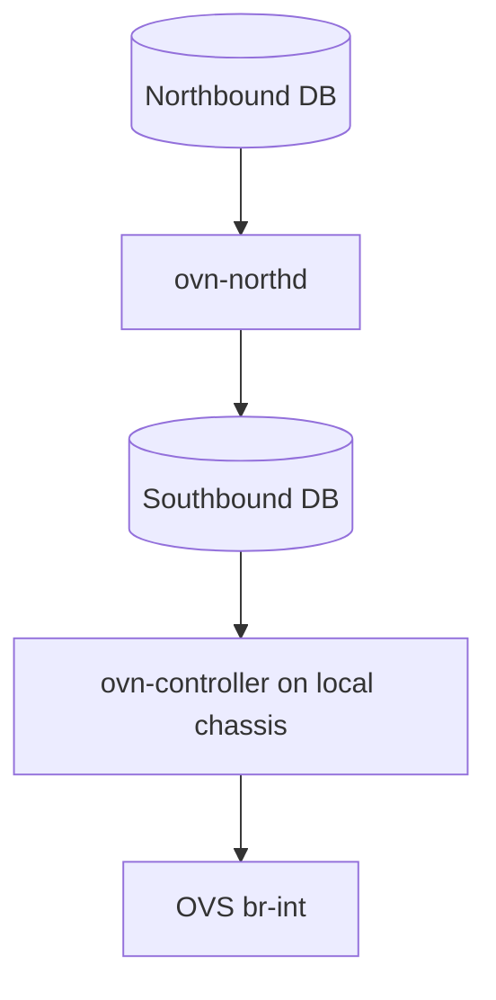
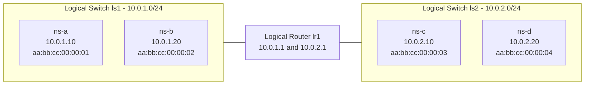

# Lab 6 - From Namespaces to OVN

| | |
|---|---|
| Tier | 3 - OVN |
| Duration | ~1 hour |
| Prerequisites | Labs 1-4 completed |
| Goal | Rebuild the Lab 5 OVN topology from namespace endpoints to routing, ACLs, and DHCP |

---

## 1. Objective

By the end of this workshop you will be able to:

- Explain OVN architecture and how it maps to OVS.
- Install and initialize OVN components.
- Create logical switches and logical ports.
- Bind logical ports to OVS interfaces connected to Linux namespaces.
- Create a logical router and route between two logical switches.
- Add OVN ACLs and validate traffic policy.
- Enable OVN-native DHCP.
- Inspect logical flows and physical OpenFlow rules.
- Map each OVN command to the OpenStack Neutron concept.

---

## 2. Lab Topology

### 2.1 Control Plane (OVN)



### 2.2 Data Plane (target state)



---

## 3. Session Plan (1 hour)

- 0-10 min: Install and initialize OVN.
- 10-25 min: Build ls1 and connect ns-a/ns-b.
- 25-35 min: Inspect logical and OpenFlow pipelines.
- 35-45 min: Add ls2, verify no cross-subnet connectivity.
- 45-55 min: Add lr1, ACLs, and DHCP.
- 55-60 min: Deep inspection, OpenStack mapping, cleanup.

---

## 4. Exercises

All commands require sudo/root privileges.

## Exercise 1 - Install OVN

This step installs the two core pieces used in the lab: the OVN central services and the local host integration components. Without these packages, there is no control plane database to define logical networking intent and no local agent to program OVS.

The verification commands establish a clean baseline before creating resources. Seeing an empty or near-empty state confirms the platform is installed and ready, so any later topology entries come from your own commands and are easy to reason about.

```bash
sudo apt install -y ovn-central ovn-host
```

Verify:

```bash
ovn-nbctl show
ovn-sbctl show
```

Expected: NB is empty; SB shows local chassis information after controller registration.

---

## Exercise 2 - Initialize OVN and register chassis

Here you bring the OVN control-plane services online and register this machine as a chassis that can host logical ports. The external-ids tell ovn-controller where to read compiled state and how this host participates in the overlay.

In practical terms, this is the handshake between OVS and OVN. Once done, OVN can target this node with bindings and flows, which is what turns abstract logical objects into actual forwarding behavior on br-int.

```bash
sudo systemctl start ovn-central
sudo systemctl start ovn-controller

sudo ovs-vsctl set open . \
  external-ids:ovn-remote=unix:/var/run/ovn/ovnsb_db.sock \
  external-ids:ovn-encap-type=geneve \
  external-ids:ovn-encap-ip=127.0.0.1
```

Verify:

```bash
ovn-sbctl show
```

---

## Exercise 3 - Create logical switch ls1 and ports

This exercise defines the first logical L2 segment and two logical endpoints in OVN's Northbound database. Think of this as declaring a virtual network and two virtual NICs, including their expected addressing identity.

The key idea is intent first: you model the network in OVN before attaching Linux interfaces. OVN then compiles this intent into logical flows, which will later be bound to real interfaces through iface-id mapping.

```bash
ovn-nbctl ls-add ls1

ovn-nbctl lsp-add ls1 ls1-port1
ovn-nbctl lsp-set-addresses ls1-port1 "aa:bb:cc:00:00:01 10.0.1.10"

ovn-nbctl lsp-add ls1 ls1-port2
ovn-nbctl lsp-set-addresses ls1-port2 "aa:bb:cc:00:00:02 10.0.1.20"
```

Verify:

```bash
ovn-nbctl show
```

---

## Exercise 4 - Bind OVN logical ports to namespaces

Now you connect Linux namespaces to OVN logical ports through OVS. Namespaces simulate workloads, veth pairs provide the cable between namespace and root namespace, and br-int is the integration bridge where OVN-controlled forwarding happens.

This is the point where logical design becomes data-plane reality. By mapping each OVS interface to an OVN logical switch port, ovn-controller can apply the correct pipeline, security checks, and forwarding decisions to namespace traffic.

### 4.1 Create namespaces

```bash
for ns in ns-a ns-b ns-c ns-d; do
  sudo ip netns delete $ns 2>/dev/null
done

sudo ip netns add ns-a
sudo ip netns add ns-b
sudo ip netns exec ns-a ip link set lo up
sudo ip netns exec ns-b ip link set lo up
```

### 4.2 Create veth pairs

```bash
sudo ip link add veth-a type veth peer name veth-a-ovs
sudo ip link add veth-b type veth peer name veth-b-ovs

sudo ip link set veth-a netns ns-a
sudo ip link set veth-b netns ns-b
```

### 4.3 Attach OVS ends to br-int and bind to OVN ports

```bash
sudo ovs-vsctl --may-exist add-br br-int
sudo ip link set br-int up

sudo ovs-vsctl add-port br-int veth-a-ovs
sudo ovs-vsctl add-port br-int veth-b-ovs
sudo ip link set veth-a-ovs up
sudo ip link set veth-b-ovs up

sudo ovs-vsctl set interface veth-a-ovs external-ids:iface-id=ls1-port1
sudo ovs-vsctl set interface veth-b-ovs external-ids:iface-id=ls1-port2
```

### 4.4 Configure IP and MAC inside each namespace to match OVN port config

```bash
sudo ip netns exec ns-a ip link set veth-a address aa:bb:cc:00:00:01
sudo ip netns exec ns-a ip addr add 10.0.1.10/24 dev veth-a
sudo ip netns exec ns-a ip link set veth-a up

sudo ip netns exec ns-b ip link set veth-b address aa:bb:cc:00:00:02
sudo ip netns exec ns-b ip addr add 10.0.1.20/24 dev veth-b
sudo ip netns exec ns-b ip link set veth-b up
```

Why this must match:

- OVN uses the logical port addresses as allowed source addresses (port security).
- If namespace MAC/IP do not match what was configured with `lsp-set-addresses`, packets are considered spoofed and dropped.
- Matching values guarantee correct ARP behavior, L2 forwarding, ACL evaluation, and later DHCP/router tests.

Verify binding and L2 connectivity:

```bash
ovn-sbctl show
sudo ip netns exec ns-a ping -c 3 10.0.1.20
```

---

## Exercise 5 - Inspect logical flows and OVS OpenFlow

At this stage connectivity works, so the goal shifts to understanding how OVN actually implements it. You inspect both logical flows (OVN view) and physical OpenFlow rules (OVS view) to see the two-layer model in action.

The packet trace commands are especially important for troubleshooting. They show the exact path and actions for one real packet, helping you correlate high-level OVN intent with concrete table matches and outputs on br-int.

```bash
ovn-sbctl lflow-list ls1
sudo ovs-ofctl dump-flows br-int | head -40
```

Packet trace from a real packet:

Terminal 1:

```bash
ns_a_mac=$(sudo ip netns exec ns-a ip link show veth-a | awk '/ether/{print $2}')
flow=$(sudo tcpdump -nXXi veth-a-ovs -c1 "ether src ${ns_a_mac}" 2>/dev/null | ovs-tcpundump)
echo "$flow"
```

Terminal 2:

```bash
sudo ip netns exec ns-a ping -c1 10.0.1.20
```

Back to Terminal 1:

```bash
in_port=$(sudo ovs-vsctl get Interface veth-a-ovs ofport)
sudo ovs-appctl ofproto/trace br-int in_port=${in_port} ${flow}
```

Logical trace:

```bash
ovn-trace --minimal ls1 \
  'inport=="ls1-port1" && eth.src==aa:bb:cc:00:00:01 && eth.dst==aa:bb:cc:00:00:02 && ip4.src==10.0.1.10 && ip4.dst==10.0.1.20 && ip.ttl==64 && icmp4'
```

---

## Exercise 6 - Create second logical switch ls2

This exercise creates a second isolated L2 domain and attaches two more namespaces. It proves that logical switches are separate broadcast and forwarding domains, even when all workloads live on the same physical host.

The verification intentionally includes one success case and one failure case. Same-switch traffic should pass, while cross-subnet traffic should fail until a router exists. That failure is expected and confirms isolation is working correctly.

```bash
ovn-nbctl ls-add ls2

ovn-nbctl lsp-add ls2 ls2-port3
ovn-nbctl lsp-set-addresses ls2-port3 "aa:bb:cc:00:00:03 10.0.2.10"

ovn-nbctl lsp-add ls2 ls2-port4
ovn-nbctl lsp-set-addresses ls2-port4 "aa:bb:cc:00:00:04 10.0.2.20"
```

Create namespaces and veth pairs for ls2:

```bash
sudo ip netns add ns-c
sudo ip netns add ns-d
sudo ip netns exec ns-c ip link set lo up
sudo ip netns exec ns-d ip link set lo up

sudo ip link add veth-c type veth peer name veth-c-ovs
sudo ip link add veth-d type veth peer name veth-d-ovs

sudo ip link set veth-c netns ns-c
sudo ip link set veth-d netns ns-d

sudo ovs-vsctl add-port br-int veth-c-ovs
sudo ovs-vsctl add-port br-int veth-d-ovs
sudo ip link set veth-c-ovs up
sudo ip link set veth-d-ovs up

sudo ovs-vsctl set interface veth-c-ovs external-ids:iface-id=ls2-port3
sudo ovs-vsctl set interface veth-d-ovs external-ids:iface-id=ls2-port4

sudo ip netns exec ns-c ip link set veth-c address aa:bb:cc:00:00:03
sudo ip netns exec ns-c ip addr add 10.0.2.10/24 dev veth-c
sudo ip netns exec ns-c ip link set veth-c up

sudo ip netns exec ns-d ip link set veth-d address aa:bb:cc:00:00:04
sudo ip netns exec ns-d ip addr add 10.0.2.20/24 dev veth-d
sudo ip netns exec ns-d ip link set veth-d up
```

Verify:

```bash
sudo ip netns exec ns-c ping -c 2 10.0.2.20
sudo ip netns exec ns-a ping -c 2 -W 2 10.0.2.10
```

Expected: first ping succeeds (same switch), second fails (no router yet).

---

## Exercise 7 - Create logical router lr1

You now introduce L3 connectivity by creating a logical router and connecting both logical switches with router-facing ports. This is the OVN equivalent of attaching subnets to a virtual router interface.

Adding default routes inside namespaces completes end-to-end routing behavior. When pings succeed across subnets, you validate that OVN is performing distributed routing semantics rather than simple L2 bridging.

```bash
ovn-nbctl lr-add lr1

ovn-nbctl lrp-add lr1 lr1-ls1 aa:bb:cc:00:01:01 10.0.1.1/24
ovn-nbctl lsp-add ls1 ls1-lr1
ovn-nbctl lsp-set-type ls1-lr1 router
ovn-nbctl lsp-set-addresses ls1-lr1 router
ovn-nbctl lsp-set-options ls1-lr1 router-port=lr1-ls1

ovn-nbctl lrp-add lr1 lr1-ls2 aa:bb:cc:00:01:02 10.0.2.1/24
ovn-nbctl lsp-add ls2 ls2-lr1
ovn-nbctl lsp-set-type ls2-lr1 router
ovn-nbctl lsp-set-addresses ls2-lr1 router
ovn-nbctl lsp-set-options ls2-lr1 router-port=lr1-ls2
```

Set default routes:

```bash
sudo ip netns exec ns-a ip route add default via 10.0.1.1
sudo ip netns exec ns-b ip route add default via 10.0.1.1
sudo ip netns exec ns-c ip route add default via 10.0.2.1
sudo ip netns exec ns-d ip route add default via 10.0.2.1
```

Verify cross-subnet routing:

```bash
sudo ip netns exec ns-a ping -c 3 10.0.2.10
sudo ip netns exec ns-c ping -c 2 10.0.1.20
```

---

## Exercise 8 - Add OVN ACLs

This step adds policy enforcement to the logical network, similar to OpenStack security group behavior. You define a deny baseline and then allow only specific traffic classes, using priorities to make rule order explicit.

The tests demonstrate that connectivity is now policy-driven, not just topology-driven. Traffic allowed by rules passes, while unmatched traffic is dropped in the OVN pipeline before it reaches the destination namespace.

```bash
ovn-nbctl acl-add ls1 from-lport 1000 'ip4' drop
ovn-nbctl acl-add ls1 from-lport 1100 'ip4 && icmp4' allow-related
ovn-nbctl acl-add ls1 from-lport 1100 'ip4 && tcp && tcp.dst==22' allow-related
```

Validate policy:

```bash
ovn-nbctl acl-list ls1
sudo ip netns exec ns-a ping -c 2 10.0.1.20
sudo ip netns exec ns-c ping -c 2 10.0.2.20
```

Optional port tests with netcat:

```bash
sudo ip netns exec ns-b bash -c 'nc -l -p 22 &'
sudo ip netns exec ns-a bash -c 'echo hello | nc -w 2 10.0.1.20 22'

sudo ip netns exec ns-b bash -c 'nc -l -p 80 &'
sudo ip netns exec ns-a bash -c 'echo hello | nc -w 2 10.0.1.20 80'
```

Cleanup ACLs after testing:

```bash
ovn-nbctl acl-del ls1
```

---

## Exercise 9 - Enable OVN-native DHCP

Here you enable DHCP directly in OVN by attaching DHCP options to logical ports. Instead of relying on an external DHCP namespace process, OVN serves DHCP behavior through flows generated from this configuration.

Flushing the static address and requesting a lease proves that addressing can be driven by network policy rather than manual host setup. This mirrors how cloud instances usually receive IP configuration at boot.

```bash
DHCP_OPTS=$(ovn-nbctl create DHCP_Options cidr=10.0.1.0/24 \
  options='"server_id"="10.0.1.1" "server_mac"="aa:bb:cc:00:01:01" "lease_time"="3600" "router"="10.0.1.1"')

ovn-nbctl lsp-set-dhcpv4-options ls1-port1 $DHCP_OPTS
ovn-nbctl lsp-set-dhcpv4-options ls1-port2 $DHCP_OPTS
```

Test from ns-a:

```bash
sudo ip netns exec ns-a ip addr flush dev veth-a
sudo apt install -y isc-dhcp-client
sudo ip netns exec ns-a dhclient -v veth-a
sudo ip netns exec ns-a ip addr show veth-a
```

---

## Exercise 10 - Deep inspection

This exercise is a state audit: you inspect topology, bindings, logical flows, and physical OpenFlow count in one pass. It helps participants connect each major concept to a concrete command output.

The ARP and tunnel checks reinforce two important scale properties of OVN: reduced broadcast through ARP suppression and metadata-rich overlays for multi-chassis forwarding.

```bash
ovn-nbctl show
ovn-sbctl show
ovn-sbctl lflow-list
sudo ovs-ofctl dump-flows br-int | wc -l
ovn-sbctl lflow-list ls1 | grep -i arp
sudo ovs-ofctl dump-flows br-int | grep -i tun
```

Key observations:

- ARP suppression is handled by logical flows instead of flooding.
- OpenFlow rules are generated by ovn-controller from OVN logical intent.
- In multi-node setups, Geneve carries OVN metadata between chassis.

---

## Exercise 11 - Capstone mapping to OpenStack

The final activity translates each manual OVN action into the equivalent OpenStack operation. This closes the gap between workshop mechanics and real cloud control-plane workflows.

The main takeaway is that Neutron plus ML2/OVN automates what you performed step by step. Understanding this mapping makes debugging easier because you can reason from OpenStack API intent down to OVN/OVS behavior.

| OVN command in this lab | OpenStack equivalent |
|---|---|
| `ovn-nbctl ls-add ls1` | `openstack network create net1` |
| `ovn-nbctl lsp-add ls1 ls1-port1` | `openstack port create --network net1 port1` |
| `ovn-nbctl lr-add lr1` | `openstack router create router1` |
| `ovn-nbctl lrp-add ...` | `openstack router add subnet ...` |
| `ovn-nbctl acl-add ...` | `openstack security group rule create ...` |
| `ovn-nbctl create DHCP_Options ...` | `openstack subnet create --dhcp-enabled ...` |
| `ovs-vsctl set interface ... iface-id=...` | Port binding done by Nova/Neutron integration |

---

## 5. Cleanup

```bash
ovn-nbctl lr-del lr1
ovn-nbctl ls-del ls1
ovn-nbctl ls-del ls2

for uuid in $(ovn-nbctl --no-headings --columns=_uuid find DHCP_Options | awk '{print $3}'); do
  ovn-nbctl destroy DHCP_Options $uuid
done

for ns in ns-a ns-b ns-c ns-d; do
  sudo ip netns delete $ns 2>/dev/null
done

for port in veth-a-ovs veth-b-ovs veth-c-ovs veth-d-ovs; do
  sudo ovs-vsctl --if-exists del-port br-int $port
done
```

---

## 6. Quick review (for instructor wrap-up)

- What does ovn-northd compile, and where does it write the result?
- Why do `iface-id` and namespace MAC/IP values need to match OVN port data?
- What is the difference between `ovn-trace` and `ovs-appctl ofproto/trace`?
- Why does OVN use Geneve instead of plain VXLAN metadata?
- Which part of this lab maps directly to OpenStack security groups?
