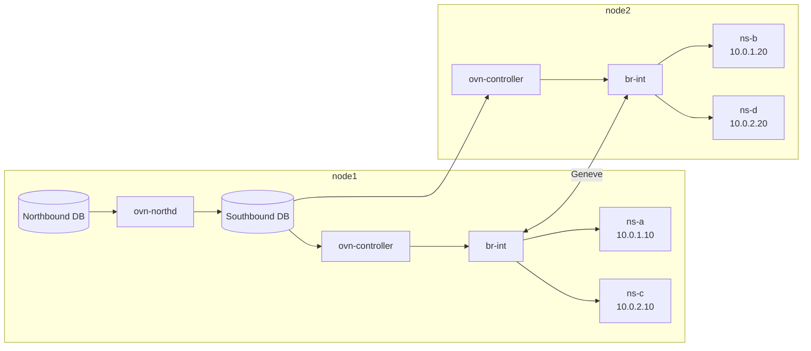
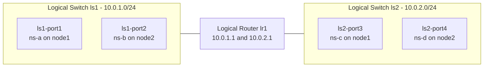

# Lab 7 - Multi-node OVN

| | |
|---|---|
| Tier | 3 - OVN |
| Duration | ~1 hour |
| Goal | Stretch the same OVN logical networks across two hosts and validate cross-host L2 and L3 connectivity |

---

## 1. Objective

By the end of this workshop you will be able to:

- Build a two-node OVN topology with endpoints split across hosts.
- Configure OVN central and chassis connectivity in a persistent way.
- Prove that a logical switch spans multiple hosts through Geneve tunnels.
- Bind local namespaces to logical ports on different chassis.
- Route between two logical switches with an OVN logical router.
- Apply ACLs and OVN-native DHCP in a multi-node setup.
- Inspect the logical and physical datapath for tunneled traffic.
- Map each manual OVN action to its OpenStack Neutron equivalent.

---

## 2. Lab Topology

### 2.1 Host layout

- `node1`: runs OVN central, OVN controller, and hosts `ns-a` (`10.0.1.10`) and `ns-c` (`10.0.2.10`).
- `node2`: runs OVN controller and hosts `ns-b` (`10.0.1.20`) and `ns-d` (`10.0.2.20`).
- `ls1` spans both nodes.
- `ls2` spans both nodes.
- `lr1` routes between `10.0.1.0/24` and `10.0.2.0/24`.

### 2.2 Control plane and data plane



### 2.3 Final logical topology



---

## 3. Before you start

Set these variables on both nodes, adjusting the values to match your environment:

On `node1`:

```bash
export NODE1_IP=192.168.122.11
export NODE2_IP=192.168.122.12
export CENTRAL_IP=$NODE1_IP
```

On `node2`:

```bash
export NODE1_IP=192.168.122.11
export NODE2_IP=192.168.122.12
export CENTRAL_IP=$NODE1_IP
```

Assumptions:

- Both nodes have IP connectivity over the management/underlay network.
- UDP `6081` for Geneve is reachable between nodes.
- The host underlay interface name may differ from machine to machine. Replace placeholders such as `<underlay-if>` with the real interface name when using `tcpdump`.

If using LXD, make sure to use VMs and not containers:

```bash
lxc launch ubuntu:24.04 ovnlab01 --vm
lxc launch ubuntu:24.04 ovnlab02 --vm
```

### Persistent configuration model

This lab stores OVN configuration in places that survive reboot:

- `systemctl enable --now ...` ensures the services start automatically after reboot.
- `ovs-vsctl set open . external-ids:...` writes the chassis settings into OVSDB.
- `ovn-nbctl set-connection ...` and `ovn-sbctl set-connection ...` write listener settings into the OVN databases.

As a result, after a reboot both nodes should reconnect automatically and the OVN topology should still exist.

---

## 4. Session Plan

- 0-10 min: Install OVN and make service configuration persistent.
- 10-20 min: Build `ls1` across two hosts.
- 20-25 min: Persist namespace and veth endpoint wiring.
- 25-35 min: Inspect logical flows and Geneve traffic.
- 35-45 min: Add `ls2` across two hosts.
- 45-52 min: Add `lr1` for inter-subnet routing.
- 52-57 min: Add ACLs and DHCP.
- 57-60 min: Inspect final state and relate it to OpenStack.

---

## 5. Exercises

All commands require sudo/root privileges.

## Exercise 1 - Install OVN packages on both nodes

This step installs the same OVN components as the single-node lab, but now on two machines. `node1` gets both central and host-side components because it will act as the control plane and as a chassis. `node2` only needs the host-side components because it consumes the Southbound database and programs its local OVS bridge.

The important idea is that OVN is distributed: the control plane can be centralized, but forwarding decisions are executed locally on each host. Installing the correct packages on each node prepares that split between central intent and per-host realization.

On `node1`:

```bash
sudo apt install -y ovn-central ovn-host
sudo systemctl enable --now openvswitch-switch ovn-central ovn-controller
```

On `node2`:

```bash
sudo apt install -y ovn-host
sudo systemctl enable --now openvswitch-switch ovn-controller
```

Verify:

On `node1`:

```bash
sudo ovn-nbctl show
sudo ovn-sbctl show
```

Both tables will be empty for now.

---

## Exercise 2 - Configure OVN persistently and register both chassis

In this step you turn one machine into the persistent OVN control plane and point both chassis at it. `node1` is configured to listen for OVN Northbound and Southbound clients, while both nodes store their chassis settings in OVS so `ovn-controller` can reconnect automatically after a reboot.

This is the operational difference from the single-node lab: instead of using only local Unix sockets, the two-node setup needs a real remote Southbound endpoint and stable encapsulation IPs. Those settings are the foundation for cross-host tunnels and remote logical port bindings.

On `node1`, configure the OVN databases to listen persistently:

```bash
sudo ovn-nbctl set-connection ptcp:6641:$NODE1_IP -- set connection . inactivity_probe=60000
sudo ovn-sbctl set-connection ptcp:6642:$NODE1_IP -- set connection . inactivity_probe=60000
```

On `node1`, configure its chassis settings persistently in OVSDB:

```bash
sudo ovs-vsctl set open . \
  external-ids:ovn-remote=tcp:$CENTRAL_IP:6642 \
  external-ids:ovn-encap-type=geneve \
  external-ids:ovn-encap-ip=$NODE1_IP
```

On `node2`, configure its chassis settings persistently in OVSDB:

```bash
sudo ovs-vsctl set open . \
  external-ids:ovn-remote=tcp:$CENTRAL_IP:6642 \
  external-ids:ovn-encap-type=geneve \
  external-ids:ovn-encap-ip=$NODE2_IP
```

Verify from `node1`:

```bash
sudo ovn-sbctl show
sudo ovn-sbctl list Chassis
```

Expected: two chassis are visible, each with a Geneve encapsulation entry and the correct management IP.

---

## Exercise 3 - Create logical switch ls1 and the first two logical ports

Now you define the first multi-node L2 segment in OVN. `ls1` is still just one logical switch, even though its endpoints will live on different hosts. The port definitions give OVN the expected MAC and IP identity for each endpoint before any Linux interface is attached.

This ordering matters because OVN is intent-driven. You first declare what the network should look like, then you attach real interfaces that satisfy that model. Once the interfaces bind, OVN can compile the correct forwarding and port-security behavior automatically.

Run on `node1`:

```bash
sudo ovn-nbctl ls-add ls1

sudo ovn-nbctl lsp-add ls1 ls1-port1
sudo ovn-nbctl lsp-set-addresses ls1-port1 "aa:bb:cc:00:00:01 10.0.1.10"

sudo ovn-nbctl lsp-add ls1 ls1-port2
sudo ovn-nbctl lsp-set-addresses ls1-port2 "aa:bb:cc:00:00:02 10.0.1.20"
```

Verify:

```bash
sudo ovn-nbctl show
```

---

## Exercise 4 - Bind ls1 ports to namespaces on different hosts

This exercise turns the logical design into a real two-host data path. You create one namespace per host, connect each namespace to the local integration bridge with a veth pair, and bind the OVS-facing end to the corresponding OVN logical port using `iface-id`.

This binding is the critical bridge between Linux networking and OVN. Once the interface on each node advertises the correct `iface-id`, OVN knows exactly which logical port lives on which chassis and can decide whether traffic stays local or must be sent through a Geneve tunnel.

### 4.1 Clean up old namespaces and OVS ports

On `node1`:

```bash
sudo ip netns delete ns-a 2>/dev/null
sudo ip netns delete ns-c 2>/dev/null
sudo ovs-vsctl --if-exists del-port br-int veth-a-ovs
sudo ovs-vsctl --if-exists del-port br-int veth-c-ovs
```

On `node2`:

```bash
sudo ip netns delete ns-b 2>/dev/null
sudo ip netns delete ns-d 2>/dev/null
sudo ovs-vsctl --if-exists del-port br-int veth-b-ovs
sudo ovs-vsctl --if-exists del-port br-int veth-d-ovs
```

### 4.2 Create namespaces and veth pairs for ls1

On `node1`:

```bash
sudo ip netns add ns-a
sudo ip netns exec ns-a ip link set lo up

sudo ip link add veth-a type veth peer name veth-a-ovs
sudo ip link set veth-a netns ns-a
```

On `node2`:

```bash
sudo ip netns add ns-b
sudo ip netns exec ns-b ip link set lo up

sudo ip link add veth-b type veth peer name veth-b-ovs
sudo ip link set veth-b netns ns-b
```

### 4.3 Attach the OVS ends to br-int and bind to OVN

On `node1`:

```bash
sudo ovs-vsctl --may-exist add-br br-int
sudo ip link set br-int up

sudo ovs-vsctl add-port br-int veth-a-ovs
sudo ip link set veth-a-ovs up

sudo ovs-vsctl set interface veth-a-ovs external-ids:iface-id=ls1-port1
```

On `node2`:

```bash
sudo ovs-vsctl --may-exist add-br br-int
sudo ip link set br-int up

sudo ovs-vsctl add-port br-int veth-b-ovs
sudo ip link set veth-b-ovs up

sudo ovs-vsctl set interface veth-b-ovs external-ids:iface-id=ls1-port2
```

### 4.4 Configure namespace MAC and IP to match the OVN port config

On `node1`:

```bash
sudo ip netns exec ns-a ip link set veth-a address aa:bb:cc:00:00:01
sudo ip netns exec ns-a ip addr add 10.0.1.10/24 dev veth-a
sudo ip netns exec ns-a ip link set veth-a up
```

On `node2`:

```bash
sudo ip netns exec ns-b ip link set veth-b address aa:bb:cc:00:00:02
sudo ip netns exec ns-b ip addr add 10.0.1.20/24 dev veth-b
sudo ip netns exec ns-b ip link set veth-b up
```

Why this must match:

- OVN treats the logical port addresses as the allowed source identity for that port.
- If the namespace sends traffic with a different MAC or IP than the one configured in OVN, OVN can drop it as spoofed traffic.
- Matching the values ensures correct ARP resolution, port-security checks, and tunnel forwarding behavior across both chassis.

Verify from `node1`:

```bash
sudo ovn-sbctl show
sudo ip netns exec ns-a ping -c 3 10.0.1.20
```

Expected: the ping succeeds even though the two namespaces are on different hosts. That traffic traverses the Geneve tunnel between `node1` and `node2`.

### 4.5 Persist namespace and veth endpoint wiring across reboots

This section is optional.

Linux namespaces, veth pairs, and in-namespace IP configuration are runtime objects, so they are not retained after reboot by default. This step installs boot-time scripts and systemd units so each node recreates its local endpoints automatically.

The scripts are idempotent and rebuild local wiring for this lab model: namespaces, veth pairs, OVS ports, iface-id bindings, MAC/IP assignments, and default routes. OVN databases remain persistent independently; this step restores the local endpoint plumbing so traffic resumes after boot.

On `node1`:

```bash
sudo install -m 0755 persistence/node1/ovn-lab-endpoints.sh /usr/local/sbin/ovn-lab-endpoints-node1.sh
sudo install -m 0644 persistence/node1/ovn-lab-endpoints.service /etc/systemd/system/ovn-lab-endpoints.service
sudo systemctl daemon-reload
sudo systemctl enable --now ovn-lab-endpoints.service
```

On `node2`:

```bash
sudo install -m 0755 persistence/node2/ovn-lab-endpoints.sh /usr/local/sbin/ovn-lab-endpoints-node2.sh
sudo install -m 0644 persistence/node2/ovn-lab-endpoints.service /etc/systemd/system/ovn-lab-endpoints.service
sudo systemctl daemon-reload
sudo systemctl enable --now ovn-lab-endpoints.service
```

Verify service status and recovered endpoints:

On `node1`:

```bash
sudo systemctl status --no-pager ovn-lab-endpoints.service
sudo ip netns list
sudo ip netns exec ns-a ip -br addr show veth-a
sudo ip netns exec ns-c ip -br addr show veth-c
```

On `node2`:

```bash
sudo systemctl status --no-pager ovn-lab-endpoints.service
sudo ip netns list
sudo ip netns exec ns-b ip -br addr show veth-b
sudo ip netns exec ns-d ip -br addr show veth-d
```

Optional reboot validation:

```bash
sudo reboot
```

After both nodes return, rerun the verification commands above and confirm cross-host ping still works.

---

## Exercise 5 - Inspect logical flows, OpenFlow, and the Geneve tunnel

Once cross-host L2 works, the next question is how OVN implemented it. This exercise shows the same two-level model as the previous lab, but now with one extra element: traffic may be encapsulated on one chassis and decapsulated on another.

The goal is to connect the logical picture to the real overlay. Logical traces explain what OVN intends to do, while `ofproto/trace`, bridge flows, and packet capture show how the local host carries out that decision and sends frames through Geneve when the destination port is remote.

On `node1`, inspect logical and physical rules:

```bash
sudo ovn-sbctl lflow-list ls1
sudo ovs-ofctl dump-flows br-int | head -40
```

The `ovn-sbctl lflow-list` command displays the logical flows that OVN has compiled for the logical switch. These are high-level forwarding rules that express OVN's intent (MAC learning, L2 switching, port security, etc.) independent of how they're implemented on any particular chassis.

The `ovs-ofctl dump-flows` command shows the OpenFlow rules currently installed on the local OVS bridge. These are the low-level, hardware-optimized rules that the local chassis actually executes, translated from the logical flows into concrete forwarding decisions using OpenFlow match-action semantics.

On `node1`, capture a real packet from `ns-a` and trace it through OVS. The command will hang waiting for the traffic is generated:

```bash
ns_a_mac=$(sudo ip netns exec ns-a ip link show veth-a | awk '/ether/{print $2}')
flow=$(sudo tcpdump -nXXi veth-a-ovs -c1 "ether src ${ns_a_mac}" 2>/dev/null | ovs-tcpundump)
echo "$flow"
```

In another terminal on `node1`, trigger traffic:

```bash
sudo ip netns exec ns-a ping -c1 10.0.1.20
```

Back on `node1`:

```bash
in_port=$(sudo ovs-vsctl get Interface veth-a-ovs ofport)
sudo ovs-appctl ofproto/trace br-int in_port=${in_port} ${flow}
```

The `ovs-appctl ofproto/trace` command simulates the execution of a packet through the OpenFlow pipeline on the specified bridge, showing which rules match, in what order they are applied, and the final actions taken (such as forwarding to a port or encapsulation with Geneve). It traces the packet without actually injecting it, providing a detailed walkthrough of how OVS would process that exact flow based on the current OpenFlow table entries.

Run a logical trace from `node1`:

```bash
sudo ovn-trace --minimal ls1 \
  'inport=="ls1-port1" && eth.src==aa:bb:cc:00:00:01 && eth.dst==aa:bb:cc:00:00:02 && ip4.src==10.0.1.10 && ip4.dst==10.0.1.20 && ip.ttl==64 && icmp4'
```

The `ovn-trace` command performs a logical-level simulation of how OVN's control plane would route a packet through the logical network topology, showing the sequence of logical flows that would be applied to the packet at each logical stage (ingress port processing, L2 switching, port security checks, etc.) without regard to which physical chassis executes them. Unlike `ovs-appctl ofproto/trace`, which shows the low-level OpenFlow translations on a specific chassis, `ovn-trace` reveals OVN's abstract intent by walking through the logical flows in the order they would be evaluated, demonstrating whether the packet would be delivered, dropped, or redirected based purely on the logical network configuration.

Optional: capture Geneve on either host while pinging:

On `node1` or `node2`:

```bash
sudo tcpdump -ni <underlay-if> udp port 6081
```

---

## Exercise 6 - Create a second logical switch ls2 across both hosts

This exercise repeats the same design pattern for a second subnet. `ls2` proves that OVN can stretch more than one logical network across multiple chassis at the same time, each with its own independent MAC learning, ARP behavior, and forwarding state.

The verification keeps the same logic as before: same-switch traffic should work across hosts, but traffic between `ls1` and `ls2` should still fail until you add a router. That separation makes it clear which part of the topology is responsible for each result.

On `node1`:

```bash
sudo ovn-nbctl ls-add ls2

sudo vn-nbctl lsp-add ls2 ls2-port3
sudo vn-nbctl lsp-set-addresses ls2-port3 "aa:bb:cc:00:00:03 10.0.2.10"

sudo vn-nbctl lsp-add ls2 ls2-port4
sudo vn-nbctl lsp-set-addresses ls2-port4 "aa:bb:cc:00:00:04 10.0.2.20"
```

Create and bind the endpoints for `ls2`.

On `node1`:

```bash
sudo ip netns add ns-c
sudo ip netns exec ns-c ip link set lo up

sudo ip link add veth-c type veth peer name veth-c-ovs
sudo ip link set veth-c netns ns-c

sudo ovs-vsctl add-port br-int veth-c-ovs
sudo ip link set veth-c-ovs up
sudo ovs-vsctl set interface veth-c-ovs external-ids:iface-id=ls2-port3

sudo ip netns exec ns-c ip link set veth-c address aa:bb:cc:00:00:03
sudo ip netns exec ns-c ip addr add 10.0.2.10/24 dev veth-c
sudo ip netns exec ns-c ip link set veth-c up
```

On `node2`:

```bash
sudo ip netns add ns-d
sudo ip netns exec ns-d ip link set lo up

sudo ip link add veth-d type veth peer name veth-d-ovs
sudo ip link set veth-d netns ns-d

sudo ovs-vsctl add-port br-int veth-d-ovs
sudo ip link set veth-d-ovs up
sudo ovs-vsctl set interface veth-d-ovs external-ids:iface-id=ls2-port4

sudo ip netns exec ns-d ip link set veth-d address aa:bb:cc:00:00:04
sudo ip netns exec ns-d ip addr add 10.0.2.20/24 dev veth-d
sudo ip netns exec ns-d ip link set veth-d up
```

Verify:

On `node1`:

```bash
sudo ip netns exec ns-c ping -c 2 10.0.2.20
sudo ip netns exec ns-a ping -c 2 -W 2 10.0.2.10
```

Expected: the first ping succeeds through the tunnel because both endpoints are on `ls2`; the second fails because there is still no router between `ls1` and `ls2`.

---

## Exercise 7 - Create logical router lr1 for inter-subnet routing

You now move from a pure L2 overlay to a routed virtual network. The logical router gives each subnet a gateway address and allows OVN to route between them without needing Linux router namespaces or iptables.

This is an especially important multi-node step because it demonstrates that both distributed switching and distributed routing are still driven by the same OVN control plane. The namespaces remain on separate hosts, but the logical topology behaves like one coherent virtual network.

Run on `node1`:

```bash
sudo ovn-nbctl lr-add lr1

sudo ovn-nbctl lrp-add lr1 lr1-ls1 aa:bb:cc:00:01:01 10.0.1.1/24
sudo ovn-nbctl lsp-add ls1 ls1-lr1
sudo ovn-nbctl lsp-set-type ls1-lr1 router
sudo ovn-nbctl lsp-set-addresses ls1-lr1 router
sudo ovn-nbctl lsp-set-options ls1-lr1 router-port=lr1-ls1

sudo ovn-nbctl lrp-add lr1 lr1-ls2 aa:bb:cc:00:01:02 10.0.2.1/24
sudo ovn-nbctl lsp-add ls2 ls2-lr1
sudo ovn-nbctl lsp-set-type ls2-lr1 router
sudo ovn-nbctl lsp-set-addresses ls2-lr1 router
sudo ovn-nbctl lsp-set-options ls2-lr1 router-port=lr1-ls2
```

Add default routes inside the namespaces.

On `node1`:

```bash
sudo ip netns exec ns-a ip route add default via 10.0.1.1
sudo ip netns exec ns-c ip route add default via 10.0.2.1
```

On `node2`:

```bash
sudo ip netns exec ns-b ip route add default via 10.0.1.1
sudo ip netns exec ns-d ip route add default via 10.0.2.1
```

Verify cross-subnet routing:

On `node1`:

```bash
sudo ip netns exec ns-a ping -c 3 10.0.2.20
```

On `node2`:

```bash
sudo ip netns exec ns-b ping -c 3 10.0.2.10
```

Expected: both pings succeed. You should also notice the routed TTL behavior just as in the single-node lab.

---

## Exercise 8 - Add OVN ACLs in a multi-node topology

This step adds policy to the overlay, not just connectivity. The ACLs are attached to the logical switch, which means OVN distributes and enforces them wherever that logical network has ports, even though the endpoints are split across two hosts.

This is one of the most useful cloud concepts in the lab: policy follows the logical port rather than the physical machine. In other words, the security behavior remains consistent no matter which chassis currently hosts the workload.

Run on `node1`:

```bash
sudo ovn-nbctl acl-add ls1 from-lport 1000 'ip4' drop
sudo ovn-nbctl acl-add ls1 from-lport 1100 'ip4 && icmp4' allow-related
sudo ovn-nbctl acl-add ls1 from-lport 1100 'ip4 && tcp && tcp.dst==22' allow-related
```

Validate policy.

On `node1`:

```bash
sudo ovn-nbctl acl-list ls1
sudo ip netns exec ns-a ping -c 2 10.0.1.20
```

On `node2`:

```bash
sudo ip netns exec ns-b bash -c 'nc -l -p 22'
```

On `node1`:

```bash
sudo ip netns exec ns-a bash -c 'echo hello | nc -w 2 10.0.1.20 22'
```

On `node2`:

```bash
sudo ip netns exec ns-b bash -c 'nc -l -p 80'
```

On `node1`:

```bash
sudo ip netns exec ns-a bash -c 'echo hello | nc -w 2 10.0.1.20 80'
```

Cleanup ACLs after testing:

```bash
sudo ovn-nbctl acl-del ls1
```

---

## Exercise 9 - Enable OVN-native DHCP across both hosts

Here you move address assignment into OVN itself. DHCP is configured once in the logical topology and then applied to logical ports regardless of which chassis hosts the actual namespace.

This is a good example of how centralized intent and distributed enforcement work together. The DHCP configuration lives in the OVN database, but the replies are produced wherever the packet is handled, without needing a dedicated `dnsmasq` namespace on each host.

Run on `node1`:

```bash
DHCP_OPTS=$(sudo ovn-nbctl create DHCP_Options cidr=10.0.1.0/24 \
  options='"server_id"="10.0.1.1" "server_mac"="aa:bb:cc:00:01:01" "lease_time"="3600" "router"="10.0.1.1"')

sudo ovn-nbctl lsp-set-dhcpv4-options ls1-port1 $DHCP_OPTS
sudo ovn-nbctl lsp-set-dhcpv4-options ls1-port2 $DHCP_OPTS
```

Test DHCP from both hosts.

On `node1`:

```bash
sudo apt install -y isc-dhcp-client
sudo ip netns exec ns-a ip addr flush dev veth-a
sudo ip netns exec ns-a dhclient -v veth-a
sudo ip netns exec ns-a ip addr show veth-a
```

On `node2`:

```bash
sudo apt install -y isc-dhcp-client
sudo ip netns exec ns-b ip addr flush dev veth-b
sudo ip netns exec ns-b dhclient -v veth-b
sudo ip netns exec ns-b ip addr show veth-b
```

Expected: both namespaces receive the correct lease on different hosts from the same logical DHCP definition.

---

## Exercise 10 - Deep inspection of the final multi-node state

This exercise is a final audit of the overlay and its chassis bindings. The goal is to see the finished environment from the database view, the per-host OVS view, and the tunnel view all at once.

At this point you should be able to reason about three layers clearly: OVN intent, chassis binding, and physical encapsulation. That is the key mental model for understanding how OpenStack networking behaves when backed by ML2/OVN.

On `node1`:

```bash
sudo ovn-nbctl show
sudo ovn-sbctl show
sudo ovn-sbctl lflow-list
sudo ovn-sbctl list Chassis
sudo ovs-ofctl dump-flows br-int | wc -l
sudo ovn-sbctl lflow-list ls1 | grep -i arp
```

On `node2`:

```bash
sudo ovs-ofctl dump-flows br-int | wc -l
sudo ovs-vsctl show
```

Optional: check for tunnel traffic while generating a remote ping:

On either node:

```bash
sudo tcpdump -ni <underlay-if> udp port 6081
```

Key observations:

- `ovn-sbctl show` should list both chassis and all bound ports.
- ARP suppression remains logical and does not require broad flooding.
- Each host has its own local OpenFlow realization of the same OVN intent.
- When the destination port is remote, OVS uses Geneve to carry OVN metadata to the other chassis.

---

## Exercise 11 - Capstone mapping to OpenStack

This final activity ties the manual lab work back to cloud operations. Everything you created by hand corresponds to something Neutron and ML2/OVN would normally create for you when instances boot, attach to networks, or receive policy.

The reason this matters is practical: when an OpenStack deployment misbehaves, the shortest path to a root cause is often to translate the OpenStack object into the OVN object and then trace it down to the local chassis datapath. This lab gives you that translation layer.

| OVN command in this lab | OpenStack equivalent |
|---|---|
| `ovn-nbctl ls-add ls1` | `openstack network create net1` |
| `ovn-nbctl lsp-add ls1 ls1-port1` | `openstack port create --network net1 port1` |
| `ovn-nbctl lr-add lr1` | `openstack router create router1` |
| `ovn-nbctl lrp-add ...` | `openstack router add subnet ...` |
| `ovn-nbctl acl-add ...` | `openstack security group rule create ...` |
| `ovn-nbctl create DHCP_Options ...` | `openstack subnet create --dhcp-enabled ...` |
| `ovs-vsctl set interface ... iface-id=...` | Nova/Neutron plugging a VM TAP into `br-int` |
| Geneve tunnel between nodes | OVN transport between compute nodes |

---

## 6. Cleanup

This cleanup removes the logical topology and local namespace wiring but intentionally leaves the persistent OVN service configuration in place. That means the lab environment can be rebooted and reused without rebuilding the control-plane connectivity.

If you enabled the endpoint persistence unit in Exercise 4.5 and want a full cleanup, disable it first so it does not recreate namespaces on the next boot.

On both nodes:

```bash
sudo systemctl disable --now ovn-lab-endpoints.service
sudo rm -f /etc/systemd/system/ovn-lab-endpoints.service
sudo rm -f /usr/local/sbin/ovn-lab-endpoints-node1.sh /usr/local/sbin/ovn-lab-endpoints-node2.sh
sudo systemctl daemon-reload
```

Run on `node1`:

```bash
sudo ovn-nbctl lr-del lr1
sudo ovn-nbctl ls-del ls1
sudo ovn-nbctl ls-del ls2

for uuid in $(ovn-nbctl --no-headings --columns=_uuid find DHCP_Options | awk '{print $3}'); do
  sudo ovn-nbctl destroy DHCP_Options $uuid
done

sudo ip netns delete ns-a 2>/dev/null
sudo ip netns delete ns-c 2>/dev/null
sudo ovs-vsctl --if-exists del-port br-int veth-a-ovs
sudo ovs-vsctl --if-exists del-port br-int veth-c-ovs
```

Run on `node2`:

```bash
sudo ip netns delete ns-b 2>/dev/null
sudo ip netns delete ns-d 2>/dev/null
sudo ovs-vsctl --if-exists del-port br-int veth-b-ovs
sudo ovs-vsctl --if-exists del-port br-int veth-d-ovs
```

Optional: if you also want to remove the persistent listener configuration from `node1`:

```bash
sudo ovn-nbctl del-connection
sudo ovn-sbctl del-connection
```
